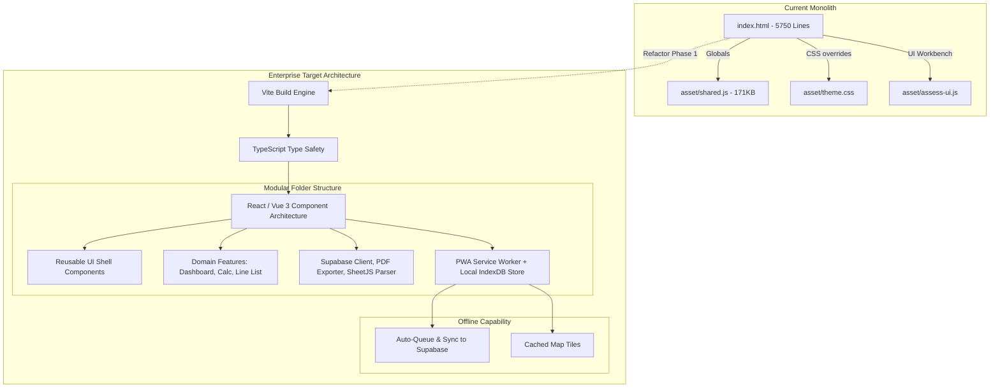

# Architectural Review & Enterprise Scaling Roadmap

**Project Name:** Pipe Assessor (Findings Tracker & ASME B31.3 Workbench)  
**Role:** Lead Frontend Architect & Design Director  
**Objective:** Evolve the existing single-page vanilla monolith into a scalable, resilient, type-safe, and secure enterprise-grade application.

---

## Executive Summary

The current implementation of **Pipe Assessor** is an excellent, low-overhead, high-performance static utility. Using Supabase for backend-as-a-service, Leaflet for maps, and client-side calculators allows it to be extremely agile. 

However, as the application expands to serve enterprise-wide inspections and compliance monitoring:
* **The Monolithic File Structure** (a 5,750+ line `index.html` incorporating views, routing, auth, state management, map logic, photo handlers, validation, and layout logic) presents a high risk of git conflict storms, high onboarding overhead for new developers, and visual styling leakage.
* **Synchronous CDN Dependencies & Blockers** delay initial loading, increase vulnerability to network drops, and inflate initial bundle size (e.g., base64 fonts embedded in blocking scripts).
* **The Online-Only Architecture** creates a critical failure point for field engineers working in remote terminals or steel-structured refineries with zero cellular coverage.

Below is the architectural roadmap to transition this project to an **Enterprise Level** while retaining its lightning-fast calculations and rich visual identity.

---

## 🗺️ Architectural Roadmap Diagram



---

## 🌟 Key Recommendations for Enterprise Level

### 1. Codebase Reorganization & Modularization (Vite + React / Vue 3)
* **Problem**: Maintaining a single HTML file with 5750 lines is unsustainable for a team. CSS selectors are prone to clash, and tracking state updates across various parts of the page requires manual DOM updates.
* **Recommendation**: Migrating to a modern React or Vue 3 app scaffolded with **Vite**.
* **Folder Structure Strategy**:
  ```
  /src
    /assets         # Optimized icons, images, brand logos (not Base64-inlined in JS)
    /components     # Atomic design system controls (Button, Field, Modal, Combobox)
    /features
      /dashboard    # KPI panels, Leaflet Map tracker, and findings grid
      /workbench    # ASME B31.3 compute wrapper, SVG rendering, advisor
      /line-list    # Master list importers, templates, and reference tables
    /services       # Supabase instance client, PDF engine, CSV parser
    /types          # TypeScript interfaces (B313Inputs, Finding, Photo)
    /utils          # Date formatters, math engines, downscalers
  ```
* **Benefits**: True separation of concerns, isolated scoped styling, and seamless branch-based developer collaboration.

### 2. Offline-First Resilience (Crucial for Field Work)
* **Problem**: A field engineer on a pipe rack cannot rely on stable cellular data. Currently, a network drop results in a login screen blocking app usage.
* **Recommendation**:
  * **Progressive Web App (PWA)**: Implement a Service Worker (via `vite-plugin-pwa`) to pre-cache the application shell, assets, and Google Sans fonts.
  * **Local Storage Queue (IndexedDB)**: Utilize an offline sync client (e.g., **RxDB** or **WatermelonDB** wrapper over Supabase) to save/edit findings local-first. When a connection is re-established, auto-synchronize changes to the backend.
  * **Offline Map Caching**: Cache Leaflet map tiles for coordinates surrounding major terminals (`KBY`, `SRC`, `BRP`) using a client-side database cache, ensuring geographical context is always visible.

### 3. TypeScript Type Safety
* **Problem**: Mathematical calculations in `computeB313` depend on strict numeric inputs. Typo bugs, missing keys, or string-to-number coercions are currently caught only at runtime.
* **Recommendation**: 
  * Rewrite utility scripts and the calculations engine in TypeScript.
  * Autogenerate database types directly from the Supabase CLI (`supabase gen types typescript`).
  * Define strict interfaces for parameters:
    ```typescript
    export interface AssessmentInputs {
      nps: string;
      schedule: string;
      material: string;
      designPressure: number; // MPa
      allowableStress: number;
      corrosionAllowance: number;
      measuredThickness?: number;
      wallLossDepth?: number;
      // ...
    }
    ```
* **Benefits**: Compile-time verification of critical safety formulas, autocomplete in IDEs, and elimination of undefined-property runtime errors.

### 4. Bundle Optimization & Dynamic Lazy-Loading
* **Problem**: 
  * `shared.js` embeds 171KB of base64 TTF fonts in a blocking script tag.
  * Heavy libraries (jsPDF, SheetJS, Leaflet) are loaded on startup, even if the user is only viewing list findings.
* **Recommendation**:
  * **Self-Host & Bundle**: Install dependencies locally via `npm` and build them into a single production bundle.
  * **Code Splitting**: Dynamic import SheetJS (`import('xlsx')`) and jsPDF (`import('jspdf')`) only when the user clicks the "Import Template" or "Export PDF" buttons.
  * **Font Optimization**: Utilize highly compressed `.woff2` files cached via browser cache headers rather than embedding TTF in raw JS strings.

### 5. Centralized State Management
* **Problem**: The app relies on query selectors, state mutation on global variables, and hash listener hooks.
* **Recommendation**:
  * Use a lightweight, reactive state store like **Zustand** (React) or **Pinia** (Vue 3).
  * Separate UI presentation from side effects (e.g., database fetching, calculations recalculation, file upload states).
* **Benefits**: Predictable state, clean state transitions, and easy caching of findings data to reduce Supabase API consumption.

### 6. Robust CI/CD & Automated Verification Pipeline
* **Problem**: Parity calculations are checked via scratchpad playbooks. Code pushes bypass automated safety checks.
* **Recommendation**:
  * Setup a CI/CD pipeline (e.g., **GitHub Actions**) running on every pull request:
    1. **Linting & Formatting**: Ensure consistency via ESLint and Prettier.
    2. **Type Checking**: Run `tsc` to verify TypeScript compile integrity.
    3. **Math Unit Tests**: Run Vitest on `computeB313` with a comprehensive test matrix of pressure, diameter, and stress parameters.
    4. **End-to-End Testing**: Automatically run Playwright tests (equivalent to `e2e-phase4.js`) in a headless container against a staging database before deploying to Render production.

### 7. Enterprise Security & Audit Compliance
* **Problem**: Audit parameters (like `created_by_email` or `updated_by`) are assigned on the client and passed in the payload, which could potentially be altered by a modified client.
* **Recommendation**:
  * **Database-Driven Auditing**: Let Postgres handle security auditing. Use Supabase database triggers to capture user identity directly from the JWT auth context (`auth.uid()` and `auth.jwt() ->> 'email'`) upon insert/update.
  * **Telemetry**: Set up error tracing via **Sentry** or **LogRocket** to capture field runtime errors (e.g., failed uploads, map tile load errors).
  * **Content Security Policy (CSP)**: Deploy strong HTTP CSP headers on Render to block script injection and keep user interaction safe.

---

> [!IMPORTANT]
> **Recommended Next Step**:  
> Initiate a **Phase 1 refactor** where a modern Vite workspace is configured. Rather than rewriting the code, port the HTML, CSS, and JS components 1:1 into modular files (`.jsx`/`.tsx` and `.css` components). This establishes the infrastructure for future TypeScript conversions and offline capability without introducing math regression errors.
